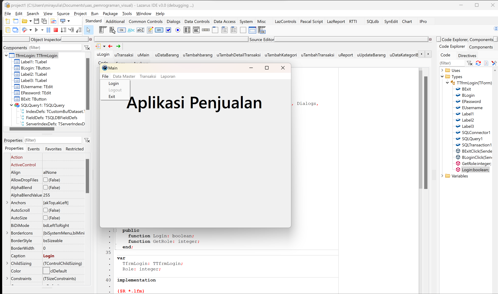
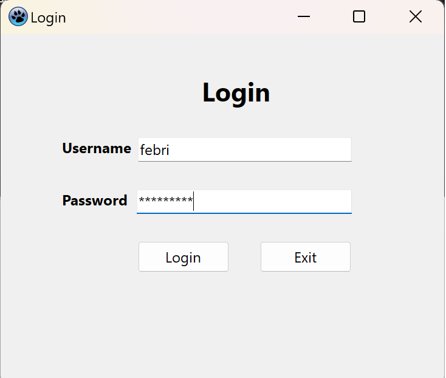
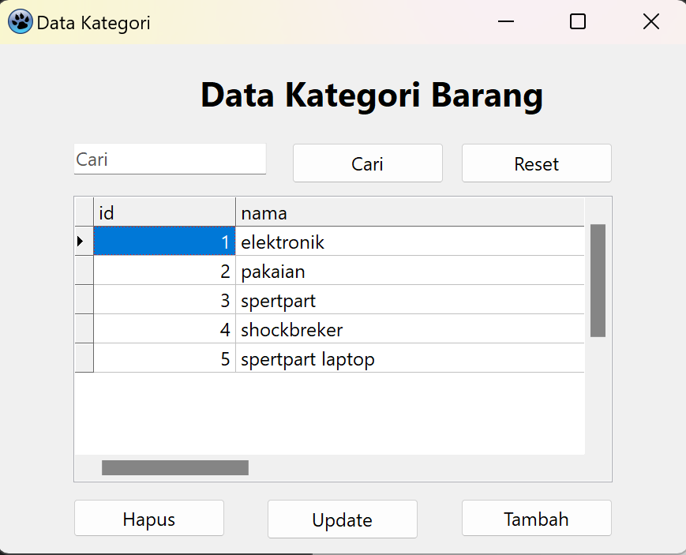
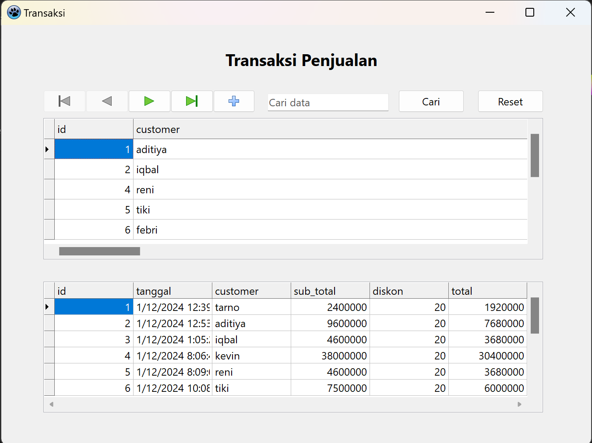
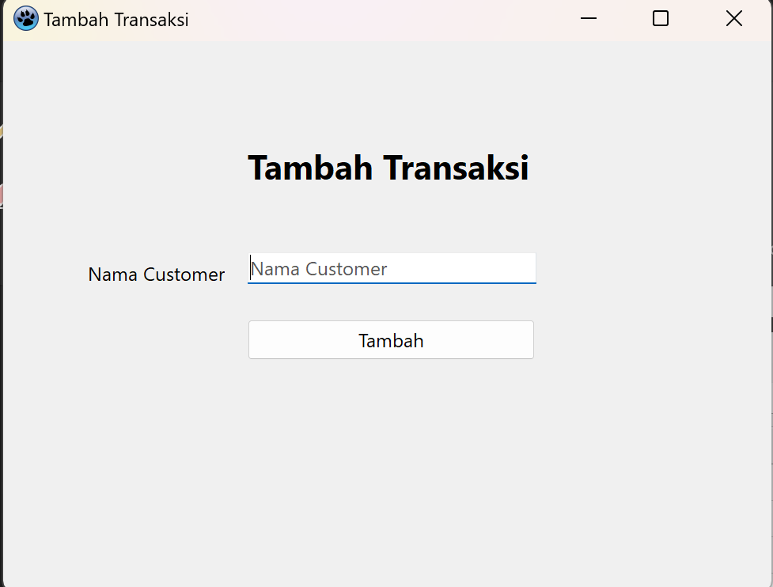
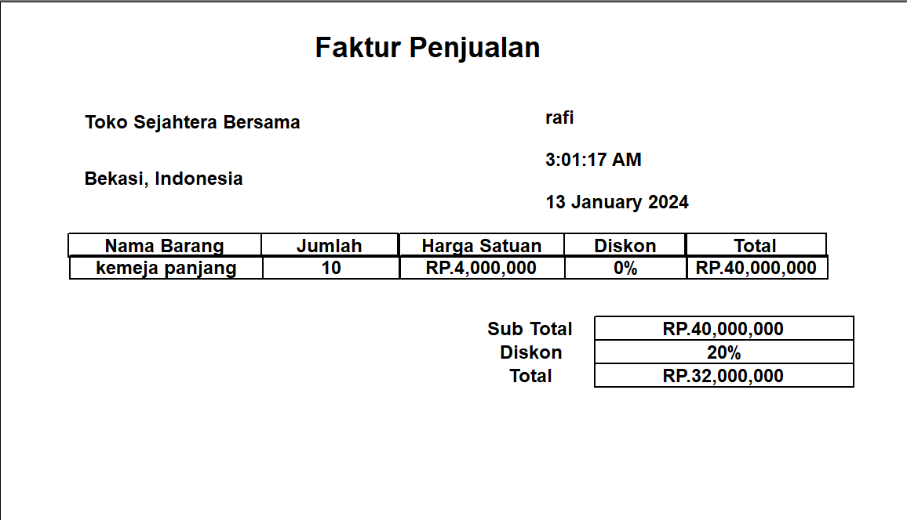
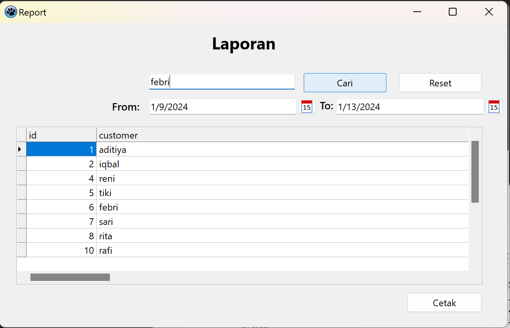
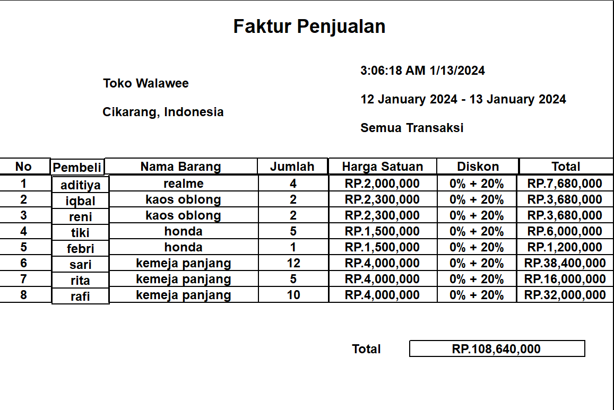

# pemr ograman_visual_uas
pembuatan aplikasi data barang

## link Demo Aplikasi : 

## Tahapan Vitur yang ada pada sistem penjualan
### Yang pertama klik file  lalu pilih login

### kemudian pada form login silahkan memasukkan username dan password yang benar kemudian klik tombol login.

### Setelah proses login berhasil, terdapat beberapa pilihan pada bagian atas dengan fitur sesuai dengan fungsi nya. 

### Yang pertama kita menuju ke Data master kemudian ke data barang untuk melihat barang yang ada pada sistem penjualan,  pada data barang dapat melakukan tambah,edit,hapus pada tabel kategori dan dapat mencari jenis kategori yang kita ingin cari.

### Setelah itu pada data master terdapat data kategori barang yang fungsinya sama seperti data barang dapat melakukan tambah,edit,hapus dan mencari. 

### Selanjutnya ada Data costumer pada data costumer ini berisi transaksi penjualan serta nama costumer nya juga.

### Setelah itu dapat berlih ke fitur transaksi pada fitur ini jika ingin menambahkan data transaksi terlebih dahulu mengisi nama costumer. Lalu dapat memilih barang yang di beli dan jumlah barang yang di ambil.

### Setelah selesai transaksi maka akan muncul struk transaksi pembelian.

### Lalu yang terkahir ada fitur laporan disini admin dapat melihat hasil laporan penjualan dan dapat di cetak semua data laporan transaksi dengan mengatur sesuai tanggal yang di ingin kan.

### Dan berikut hasil cetak laporan penjualan 

# Selesai
